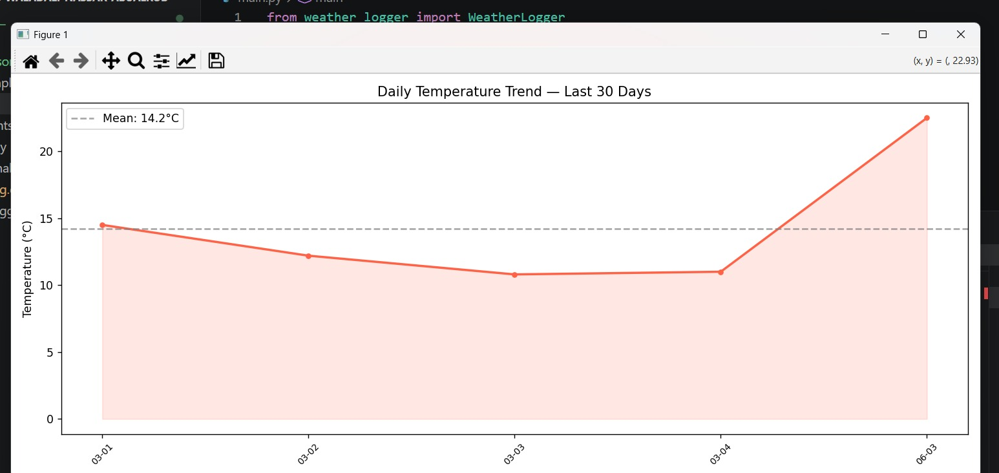
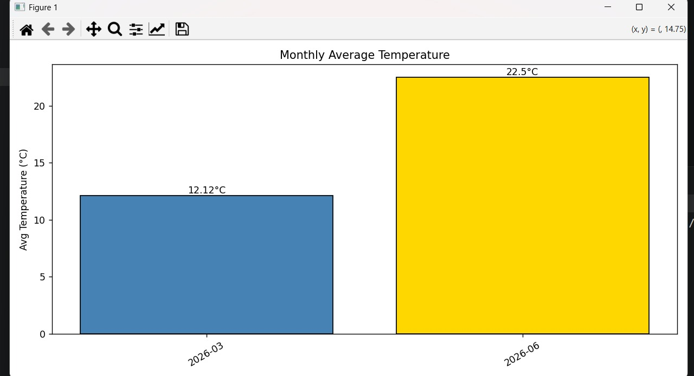
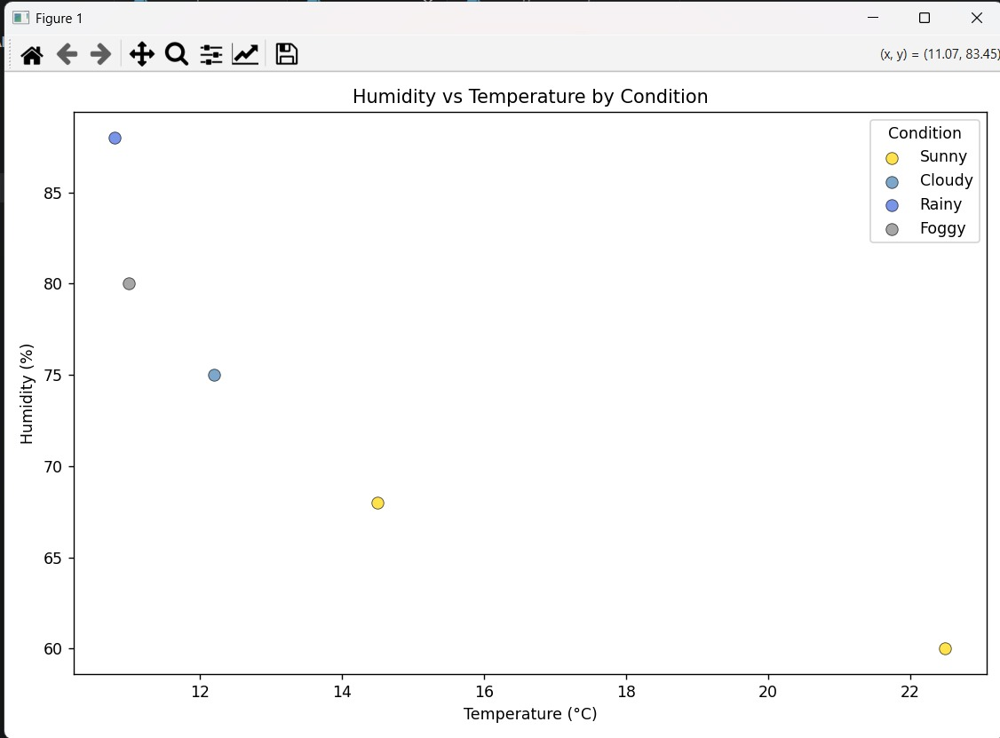
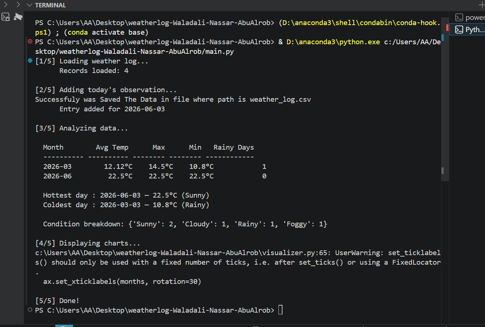

1. Project Title & Members
# WeatherLog — Daily Weather Analyzer
**Course:** Python Programming
**Members:**
- Ibrahim Waladali     — 202211030  — Responsible for: weather_logger.py, create_sample_data.py
- Abed-Alwahab Nassar  — 202211120  — Responsible for: weather_analyzer.py, requirements.txt
- Abdullah AbuAlrob    — 202210105 — Responsible for: visualizer.py, main.py

**GitHub Repository:** https://github.com/iwaladali/weatherlog-Waladali-Nassar-AbuAlrob

2. Project Description
WeatherLog is a Python app that records, analyzes, and shows daily weather info. It stores temps, humidity, wind speeds, and weather conditons in a neat format. Its main aim? To help spot weather trends, like monthly averages and wild swings easily. For data storage and stats, it relies on CSV files and NumPy. Plus, it uses Matplotlib to make graphs that aid in making sense of all this info. With these tools, WeatherLog is handy for everyday 

3. Libraries Used

| Library | Version | How it was used |
|---|---|---|
| csv | built-in | Load and save weather records |
| datetime | built-in | Date validation and today's date |
| numpy | 2.4.6 | mean, max, min, std for monthly stats |
| matplotlib | 3.10.9 | Line chart, bar chart, scatter plot |

4. Module Description

WeatherLogger.py 

class is designed to manage weather records stored in CSV files. It provides functionality for loading and saving weather data, adding new weather entries with validation, and retrieving records for a specific month.
Its most important method is add_entry(), which ensures data integrity by validating the date format, preventing duplicate records, checking that temperature and humidity values are within acceptable ranges, and verifying that the weather condition is valid before adding the entry to the log.

WeatherAnalyzer.py

 tackles weather records kept in a list of dictionaries. It has a main method called monthly_stats(), which sorts the data by month and uses NumPy to figure out stats like average, max, and min temperatures and humidity levels. There's also a find_extreme() method to track down the hottest, coldest, or most humid day using a specific field. Plus, condition_summary() counts up each kind of weather. So, this module turns raw weather info into something more insightful.

visualizer.py

The Visualizer class is responsible for creating graphical representations of the weather data using Matplotlib and NumPy. It provides multiple visualization methods, including temperature trends, monthly average temperature charts, and humidity versus temperature scatter plots. The most important method is temp_trend() which displays the temperature changes over the last 30 recorded days and highlights the average temperature with a reference line.

main.py

The main.py file serves as the entry point of the Weather Analysis project and coordinates the complete workflow. It creates instances of the WeatherLogger, WeatherAnalyzer, and Visualizer  classes, then loads data, adds a new weather record, performs analysis, and displays visualizations. The most important function is main(), which executes the entire pipeline from data processing to statistical reporting and chart generation.

5. Test Cases

#### Test 1: add_entry() – Invalid Condition

This test verifies that the add_entry() method correctly validates weather conditions before adding a new record. An invalid condition value ("Stormy") was provided, which is not included in the list of allowed conditions (Sunny, Cloudy, Rainy, Foggy). As expected, the method raised a ValueError, confirming that invalid weather conditions are rejected and data integrity is maintained.

Input: condition = "Stormy"

Expected Output: ValueError raised

Actual Output: Caught: Condition must be one of ['Sunny', 'Cloudy', 'Rainy', 'Foggy'] - PASS

```python
from weather_logger import WeatherLogger

wl = WeatherLogger()

try:
    wl.add_entry([], "2026-05-10", 20.0, 65.0, 15.0, "Stormy")
    print("No error raised - FAIL")
except ValueError as e:
    print(f"Caught: {e} - PASS")
```


#### Test 2: find_extreme() – Hottest Day

This test verifies that the find_extreme() method correctly identifies the weather record with the highest temperature. A list of weather records with different temperatures was provided as input. The method successfully returned the record with the maximum temperature, confirming that the extreme value search works correctly.

Input: Three weather records with temperatures 14.5°C, 12.2°C, and 22.5°C

Expected Output: The record dated "2026-06-03" with temperature 22.5°C is returned.

Actual Output: {'date': '2026-06-03', 'temp_c': 22.5, 'condition': 'Sunny'}


```python

from weather_analyzer import WeatherAnalyzer

wa = WeatherAnalyzer()

logs = [
    {"date": "2026-03-01", "temp_c": 14.5, "condition": "Sunny"},
    {"date": "2026-03-02", "temp_c": 12.2, "condition": "Cloudy"},
    {"date": "2026-06-03", "temp_c": 22.5, "condition": "Sunny"}
]

result = wa.find_extreme(logs, "temp_c", "max")

print(result)
```

#### Test 3: monthly_stats() — average temperature verification

Input:

Three weather records for May 2026 with temperatures:

20°C
25°C
30°C

Manual average:

(20 + 25 + 30) / 3 = 25°C

Expected Output:

avg_temp = 25.0

Actual Output:

avg_temp = 25.0 


Code snippet used to verify:

```python

from weather_analyzer import WeatherAnalyzer

wa = WeatherAnalyzer()

logs = [
    {"date":"2026-05-01","temp_c":"20","humidity_pct":"60","wind_kph":"10","condition":"Sunny"},
    {"date":"2026-05-02","temp_c":"25","humidity_pct":"65","wind_kph":"12","condition":"Cloudy"},
    {"date":"2026-05-03","temp_c":"30","humidity_pct":"70","wind_kph":"14","condition":"Rainy"}
]

stats = wa.monthly_stats(logs)

print(stats["2026-05"]["avg_temp"])

```

#### Test 4: Full main.py run

Input: --no input is needed
Execute:

python main.py

using a valid weather_log.csv file.

Expected Output:
Weather log loaded successfully.
New entry added or skipped if today's date already exists.
Monthly statistics displayed.
Hottest and coldest day displayed.
Condition summary displayed.
Three charts appear:
Daily Temperature Trend
Monthly Average Temperature
Humidity vs Temperature Scatter Plot
Program terminates without errors.

Actual Output:

The application completed all five stages successfully, displayed the analysis results, and opened all three charts without raising exceptions. 


6. Screenshots
### Temperature Trend

*Line chart of daily temperatures over the last 30 days with mean line*

### Monthly Average

*Bar chart of average temperature per month — color-coded by temperature range*

### Humidity vs Temperature

*Scatter plot of humidity vs temperature, colored by weather condition*

### Terminal Output

*Full output of running python main.py*

7. Individual Contributions

| Student | ID | Files | Commit Count | GitHub Username |
|---|---|---|---|---|
| Ibrahim Waladali    | 202211030  | weather_logger.py, create_sample_data.py | 7 | iwaladali |
| Abed-Alwahab Nassar | 202211120  | weather_analyzer.py, requirements.txt   | 5 | Abed-Alwahab |
| Abdullah AbuAlrob   | 202210105 | visualizer.py, main.py                  | 4 | Abdullahabualrob |

8. Challenges & What You Learned

Ibrahim Waladali (202211030):
One challenge I faced in weather_logger.py was implementing the validation logic in the add_entry() method. I needed to ensure that all weather records were accurate by checking the date format, preventing duplicate dates, validating temperature and humidity ranges, and restricting weather conditions to a predefined list.

To solve this, I used datetime.strptime() to validate the date format, checked for duplicate dates using the any() function, and added conditional statements that raise ValueError exceptions whenever invalid data is entered. This approach ensures that only valid and consistent weather records are stored in the log.

Abed-Alwahab Nassar (202211120): 
A major problem in weather_analyzer.py was figuring out how to use NumPy functions without messing up JSON and dictionary outputs. NumPy gave me special numeric types like np.float64, causing issues when saving results. I solved this by converting them with float(). 
I also struggled with monthly record grouping. Instead of wrestling with datetime, I used string slicing (date[:7]). This actually simplified things and made the code more efficient. Overall, this project taught me to blend Python data structures with NumPy for analyzing real dataset stats effectively.

Abdullah AbuAlrob (202210105):
While working on visualizer.py , I faced a challenge in making the charts easy to read when there were many weather records. To solve this, I displayed only the most recent 30 records and rotated the date labels so they would not overlap. Another challenge was making the monthly temperature chart more informative, so I used different colors for different temperature ranges and added the exact average value above each bar to make the results clearer.

9. How to Run

### Install dependencies
​```bash
pip install -r requirements.txt
​```
> Generated with `pip freeze > requirements.txt`

### Create sample data
​```bash
python create_sample_data.py
​```

### Run the app
​```bash
python main.py
​```